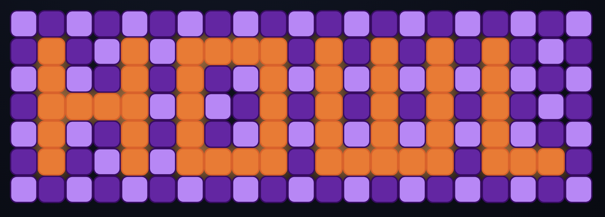
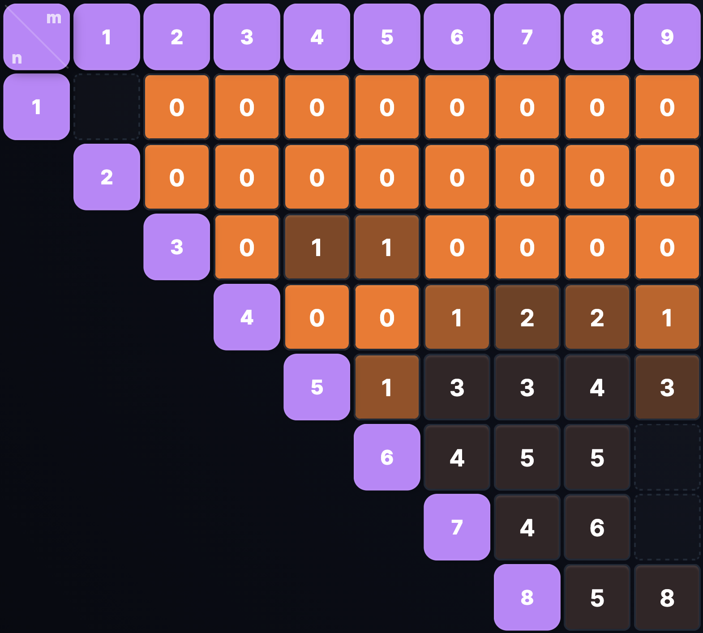

# HOWL - Hyper Optimizing Wolf's Logic

A highly responsive, web-based crowdsourcing game designed to solve the vertex $k$-ranking problem on grid graphs. By disguising rigorous mathematical bounding as a spatial puzzle, HOWL lets humans use their innate pattern recognition to contribute to open graph theory research.

<div align="center">
  
</div>

## Features

- **Interactive Grid Visualizer**: High-performance PixiJS-based WebGL renderer featuring cut selection, split-view pane layouts, and responsive dynamic resizing.
- **Custom Grid Sizes**: Create or restart any grid up to $100 \times 100$.
- **Cut Set Management**: Toggle vertices for removal and explore permutations with full undo/redo history.
- **Batch Actions**: Automatically vaporize identical subgraphs, ignore subgraphs that fit entirely within others, or instantly auto-solve board states that are mathematically proven to be perfect (The Abacus).
- **The Magic Wand**: Encounter a shape the community has already solved? Click the magic wand icon to instantly "vaporize" it using the best known solution from our database.
- **Game Replays**: A full VCR-style replay engine. Watch community solutions, step through cut-by-cut, and observe the dynamic elimination tree construct the rank. Fork any replay to branch off and find a better score.
- **Leaderboard Matrix**: A robust matrix view of best scores across all grid sizes, including perfection gap analytics, linear density scaling, and top-solver standings.
- **Theming & Palettes**: Personalize your puzzle experience with customizable block color palettes and full light/dark mode support.

<div align="center">
  
</div>

## Project Structure

```text
howl-project/
├── alphawolf/                # AlphaZero-style RL pipeline
│   ├── envs/                 # Custom Howl environments
│   ├── models/               # PyTorch neural network definitions
│   ├── db/                   # Tablebase interface & replay gatekeeper
│   ├── tests/                # AlphaWolf test suite (math, MCTS, gatekeeper, GNN)
│   ├── train.py              # Main training loop (MCTS + Self-Play)
│   ├── benchmark.py          # Automated model evaluation & gauntlet
│   └── ARCHITECTURE.md       # RL engine architecture documentation
│
├── backend/                  # Python/FastAPI app + SQLite
│   ├── venv/                 # Virtual environment
│   ├── main.py               # FastAPI entry point & lifespan events
│   ├── routes/               # API routers (auth, game, leaderboards)
│   ├── services/             # Application services
│   ├── tests/                # Backend API, hashing, and replay tests
│   ├── database.py           # SQLite connection & session configuration
│   ├── models.py             # SQLAlchemy ORM models
│   ├── schemas.py            # Pydantic validation schemas
│   ├── requirements.txt      # Python dependencies
│   ├── .env                  # Backend environment variables
│   └── ARCHITECTURE.md       # Backend architecture documentation
│
├── core_engine/              # Shared pure-python business logic package
│   ├── core_engine/          # graph_logic, hashing, replay_engine
│   └── pyproject.toml        # Package definition
│
├── frontend/                 # React/Vite app
│   ├── package.json          
│   ├── vite.config.ts        
│   ├── ARCHITECTURE.md       # Frontend architecture documentation
│   └── src/                  
│       ├── api/              # API wrapper functions and DTO compaction
│       ├── assets/           # Static images and SVGs
│       ├── components/       # UI components divided by feature (layout, ui, game-page, leaderboard-page, etc.)
│       ├── hooks/            # Custom React hooks (e.g., useAlias, useReplayEngine, useGraphLogic)
│       ├── pages/            # Top-level route components (Game, Leaderboard, Login, Replay, Settings, Docs)
│       ├── state/            # Redux Toolkit slices (gameSlice, settingsSlice) and store
│       ├── styles/           # Vanilla CSS stylesheets with CSS variable theming
│       ├── utils/            # Math, hashing, and graph utility functions
│       ├── App.tsx           # React Router setup
│       └── main.tsx          # React DOM entry point
│
├── Problem_Description.md    # Mathematical foundation of the game
└── README.md
```

## Setup & Run

The project uses a single shared Python virtual environment (`backend/venv`) for all Python components (`backend`, `alphawolf`, and the editable `core_engine` package).

### 1. Frontend (React / PixiJS)

```bash
cd frontend
npm install
npm run dev
```
Runs on `http://localhost:5173` by default (Vite).

### 2. Python Environment Setup (Shared for Backend & AlphaWolf)

```bash
cd backend
python -m venv venv
source venv/bin/activate
pip install -r requirements.txt
pip install -r ../alphawolf/requirements.txt
```

### 3. Run Backend Server (FastAPI)

With the virtual environment activated:
```bash
# From the backend/ directory:
uvicorn main:app --reload --host 127.0.0.1 --port 8000
```
Runs on `http://127.0.0.1:8000` by default.

### 4. Run AlphaWolf (RL Engine & CLI Tools)

With the virtual environment activated (`source backend/venv/bin/activate`):

```bash
cd alphawolf

# Query the database & 10x10 rank matrix:
python query_db.py

# Run high-simulation discovery rollouts:
python eval.py

# Start AlphaZero multi-process training loop:
python train.py
```

## Running Tests

Once your virtual environment is activated (`source backend/venv/bin/activate`), run tests directly with `pytest`:

### Fast AlphaWolf Math & Unit Tests (~5–8s)
Verifies $D_4$ hashing, Tarjan cut vertex detection, replay gatekeeper validation, MCTS virtual loss, and GNN message passing:
```bash
pytest alphawolf/tests/ -k "not test_alpha_zero_1_generation_dry_run" -v
```

### Full AlphaWolf Test Suite (including 1-gen training dry run)
```bash
pytest alphawolf/tests/ -v
```

### Backend & API Tests
Runs hashing, replay engine, and FastAPI endpoint tests:
```bash
pytest backend/tests/ -v
```

### Run All Tests
```bash
pytest alphawolf/tests/ backend/tests/ -v
```

*(Note: If running without activating the virtualenv first, prepend `backend/venv/bin/pytest`)*

## Deployment

The project is designed to be deployed across two separate services:
- **Frontend**: Deployed as a static Vite/React application. Expects a `VITE_API_URL` environment variable pointing to the backend.
- **Backend**: Deployed running FastAPI with a persistent volume for the `howl.db` SQLite database. Requires an `AUTH_SECRET` environment variable for administrative gatekeeping.

## Architecture

See [`alphawolf/ARCHITECTURE.md`](alphawolf/ARCHITECTURE.md) for a deep dive into the Reinforcement Learning pipeline, MCTS search, model benchmarking, and mathematical verification tests.

See [`backend/ARCHITECTURE.md`](backend/ARCHITECTURE.md) for a detailed technical overview of the backend server and its interactions with the shared core engine.

See [`frontend/ARCHITECTURE.md`](frontend/ARCHITECTURE.md) for details on the React/PixiJS rendering loop, Redux state management, and mobile-responsive layout.
